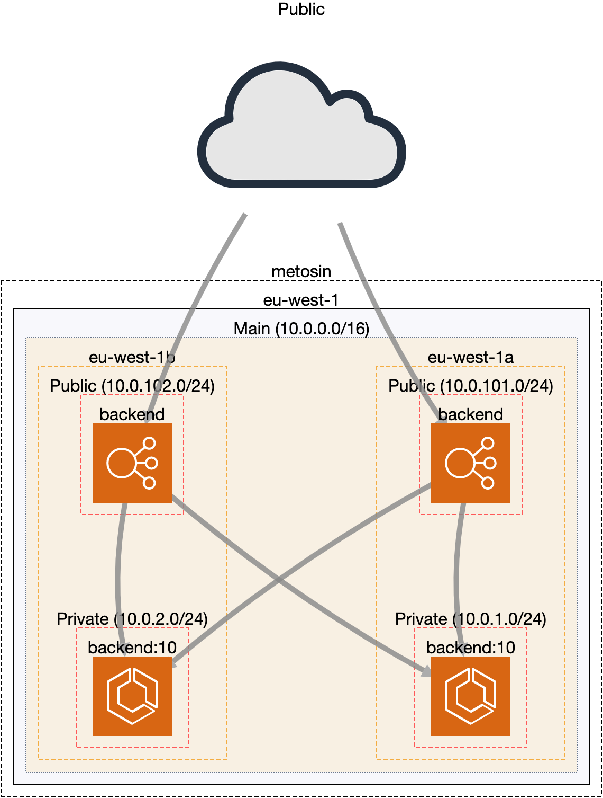

# Terraform Fargate service for a Clojure app

Provides and example of a AWS Architecture for running a ECS service. The app provided in the repo is a JVM/Clojure application, built into Docker image via [pack.alpha](https://github.com/juxt/pack.alpha#docker-image)

## Architecture

The AWS architecture is created via Terraform by two modules:

### [common](terraform/common)

A VPC with public (for ALB) and private (for backends) subnets. Contains the following resources defined via Terraform:

* aws_eip.nat
* aws_internet_gateway.igw
* aws_nat_gateway.nat-gw
* aws_route_table.private
* aws_route_table.public
* aws_route_table_association.private-a
* aws_route_table_association.private-b
* aws_route_table_association.public-a
* aws_route_table_association.public-b
* aws_subnet.private-a
* aws_subnet.private-b
* aws_subnet.public-a
* aws_subnet.public-b
* aws_vpc.main
  
### [backend](terraform/backend)

A ECS service with a load balancer. Contains the following resources defined via Terraform:

* aws_cloudwatch_log_group.backend
* aws_ecs_cluster.backend
* aws_ecs_service.backend
* aws_ecs_task_definition.backend
* aws_iam_role.backend
* aws_iam_role_policy_attachment.backend
* aws_lb.backend
* aws_lb_listener.http
* aws_lb_target_group.backend
* aws_s3_bucket.backend-lb-logs
* aws_s3_bucket_policy.backend-lb-logs
* aws_security_group.backend
* aws_security_group.lb

### [ci](terraform/ci)

Module for Continuous Integration resources. Contains the following resources defined via Terraform:

* aws_ecr_repository.backend

Below is a network diagram of the architecture:

